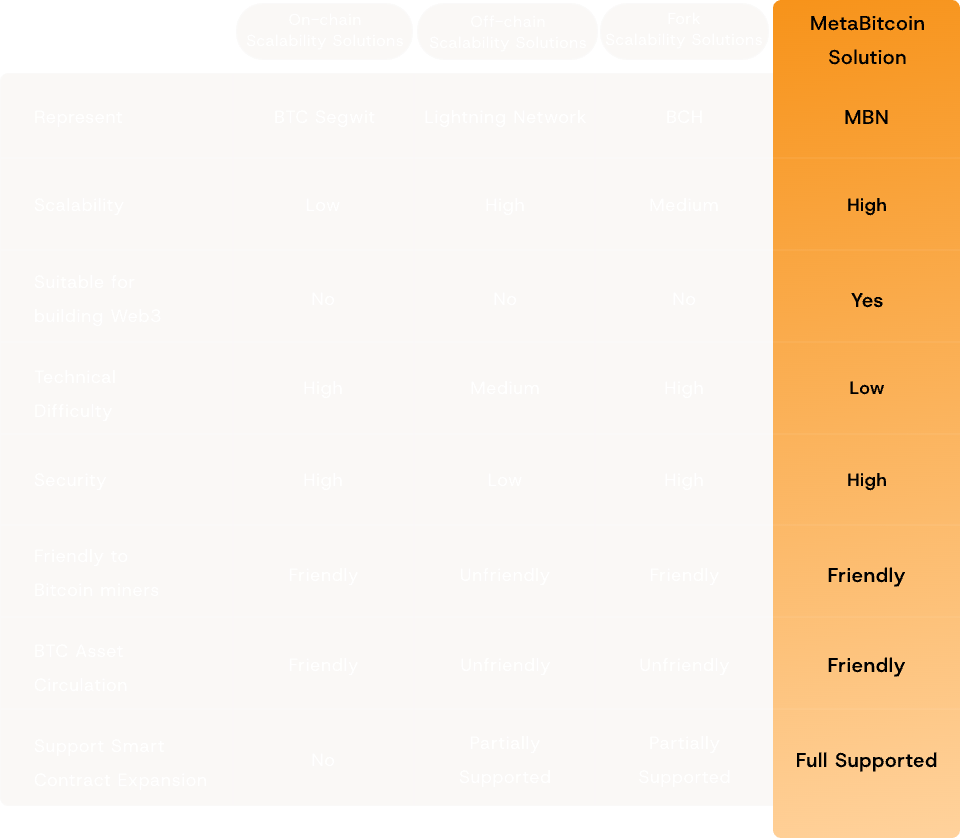
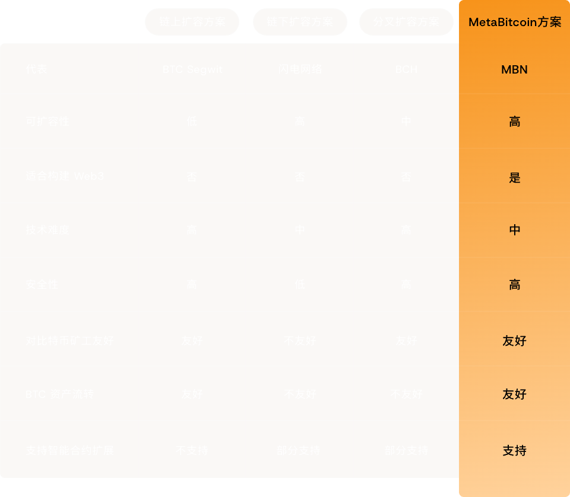

# MetaBitcoin Network

[English](#what-is-metabitcoin-network) | [中文](#什么是metabitcoin网络)

---

### What Is MetaBitcoin Network?
**MetaBitcoin Network is a BTC chain-centric network that dynamically links other Bitcoin-compatible chains, weaving them into a vast and infinitely scalable Bitcoin network. This network has the potential to fully address Bitcoin's scalability issues and to create a Bitcoin-based Web3 world for 8 billion people globally.**

**Key Features**  
- Based on Bitcoin's technical architecture and consensus mechanism, eliminating the need to invent new technologies.  
- Capable of linking to mainstream UTXO chains without requiring extensive development or the creation of new chains.  
- Dynamically infinitely scalable, able to accommodate the daily Web3 needs of people worldwide.  
- Fully leverages the infrastructure of other Bitcoin sidechains, such as layer-1 smart contracts or layer-2 EVMs.

---

### Comparison with Other Bitcoin Scalability Solutions

---

### Why It is Important for Bitcoin
#### Capable of building a Web3 world on Bitcoin for 8 billion users
Based on the trust of Bitcoin, leveraging its characteristics and potential to meet the needs of a large number of users and achieve Web3 functional innovations such as identity authentication and value exchange.

#### Bitcoin and Bitcoin-native assets can be transferred atomically to other sidechains
Atomic transfer ensures the security and integrity of assets through cryptographic algorithms and smart contracts. It increases the flexibility of use, allowing the selection of a trading environment according to the characteristics of the side chain, such as a side chain with low fees, a side chain for industrial applications, etc. This promotes the development of the side chain ecosystem, brings value and liquidity, and attracts developers and users.

---

### How It Works
#### Utilization of existing standard-compliant UTXO public chains
Existing compliant UTXO public chains are the bedrock. Mature, stable, they slash costs & time. Nodes & power, ready-made. Their models, a springboard for complex apps.

#### A UTXO multi-chain asset bridge with wrapping and mapping functionalities
The UTXO multi-chain asset bridge, with its Wrapping function, breaks the barriers between chains to package assets. The Mapping function establishes mappings to ensure the integrity of information and promote the smooth flow of assets.

#### Rolling up the mapping relationships of related assets from various Bitcoin-compatible chains to the main Bitcoin chain
Rollup operation pools UTXO chains' asset mappings to BTC main chain, boosting efficiency, easing load, ensuring info reliability via BTC's authority, and augmenting network scalability and user trust.

#### Eligible MBN Sidechains
- MVC (MicrovisionChain) and its replica chains
- FB (Fractal Bitcoin) and its replica chains
- BCH (Bitcoin Cash)
- BSV (Bitcoin SV)
- XEC (eCash)

#### Conditions for MBN Sidechains
1. Must be a permissionless public chain.
2. Must be Bitcoin-compatible, including the use of UTXO architecture and support for Legacy addresses.
3. Utilizes the SHA256 mining algorithm, with an average hashing power of no less than 10 PH/s over a 30-day period.

---

### Frequently Asked Questions

#### Is MetaBitcoin Network a specific chain? Does it have a project token?
MBN is NOT a specific chain or project; it is a practical solution for extending the Bitcoin network. It utilizes existing UTXO public chains and technologies, combined with suitable asset bridges and data rollup solutions, to create a Bitcoin-based Web3 solution. This approach not only aims to extend Bitcoin as digital gold but also serves as a Web3 network capable of accommodating the everyday needs of 8 billion users.

It does not have a specific project token and has not received VC funding; it is a permissionless, fully open solution designed for the future emergence of massive Web3 applications. It represents a vision and, from a technical perspective, may be the simplest and most elegant approach to building a Web3 scalability solution for Bitcoin.

#### Why does MetaBitcoin Network connect UTXO public chains like MVC and BCH?
MBN can be compatible with most of the mainstream UTXO public chains nowadays, including BCH, BSV, FB and MVC, etc. MBN has no preference for any UTXO public chains that meet the standards. MBN will link the mainstream UTXO public chains and their replica chains. Ultimately, which solution is used the most will be decided by the users, so different UTXO public chains connected to MBN will compete in terms of performance, fees, and smart contract capabilities to attract the most users.

Connecting different types of UTXO public chains provides more possibilities for enriching Bitcoin assets. For example, after MBN connects to BCH, Bitcoin assets may be able to utilize the EVM layer on BCH to achieve more possibilities; after MBN connects to MVC, Bitcoin assets may be able to utilize the layer-one smart contract capabilities on MVC to achieve more complex financial and Web3 use cases.

#### What's the relationship between MetaBitcoin Network and MetaID?
MetaBitcoin is a Bitcoin expansion plan proposed by the MetaID protocol team. The MetaID protocol is a Web3 construction plan designed for Bitcoin. Based on the MetaID protocol, various Web3 applications can be developed in the Bitcoin ecosystem, such as on-chain Twitter, on-chain Facebook, on-chain Amazon, and on-chain TikTok. However, Bitcoin has not solved the scalability issue, resulting in extremely high fees and congestion, preventing these on-chain applications from being widely promoted. Therefore, the MetaID protocol team proposed a scalability solution for Bitcoin. The MetaID protocol team believes that the MetaID protocol + MBN solution can establish a permissionless, open Web3 world on Bitcoin that can accommodate massive daily use by users.

#### What's the relationship between MetaBitcoin Network and FB?
Some of the goals and visions of MBN and FB are the same. They both aim to expand Bitcoin and do so by connecting other chains with BTC as the core. However, there are three main differences:

1. FB can only link the BCSP (Bitcoin Core Software Package) constructed by the replication program of Bitcoin Core nodes, while MBN is more open and can be compatible with all existing UTXO public chains that meet the conditions, including BCH, BSV, MVC, and even FB; MBN can include FB, but FB cannot include MBN; FB has a dedicated project token and a dedicated project team, while MBN has no tokens or funding. It is a combination solution that utilizes existing public chains and technologies, requiring no significant development itself, and is more of an open, permissionless technical combination solution belonging to the developer community.

2. Because MBN is more open and can be compatible with all excellent UTXO public chains in the industry (such as BCH, MVC, etc.), MBN has more advanced capabilities than FB, such as utilizing the EVM layer on BCH and the layer-one UTXO smart contract capabilities on MVC. This gives Bitcoin assets more possibilities and makes full use of all mature ecosystems in the larger Bitcoin ecosystem.

3. FB is more positioned to expand Bitcoin as digital gold and electronic currency (according to its official website and white paper), and FB's architecture and design are not suitable for large amounts of data on-chain and lack a Web3 construction plan. MBN, from day one, was planned and designed to solve the future massive Web3 applications on Bitcoin. Its goal is clear and straightforward: to use the MetaID protocol and existing large Bitcoin ecosystem facilities to build a secure, user-owned data, high-performance Web3 network on Bitcoin that can meet the daily needs of people worldwide.

---

### 什么是MetaBitcoin网络？
**MetaBitcoin Network 是一个以 BTC 链核心的，可动态链接其他比特币同构链从而编织成一个动态且无限扩展的比特币同构网络。这个网络可彻底解决比特币的扩容问题并且可在其上打造供全世界 80亿人使用的基于比特币的Web3 网络。**

**核心特性**  
- 整体基于比特币的技术架构和共识机制，无需发明新的技术。  
- 可链接主流的 UTXO 链，无需大量开发或发新的公链。  
- 可动态无限扩展，可承载全世界人类日常 Web3需求。  
- 可充分利用其他侧链的基础设施，比如一层智能合约或二层 EVM 等。

---

### 与其他比特币扩容方案对比

---

### 为什么这对比特币很重要
#### 可承载80亿用户的比特币Web3世界
基于比特币的信任机制，充分利用其特性和潜力，满足大量用户需求，实现身份认证、价值交换等Web3功能创新。

#### 比特币原生资产可原子化跨链转移
原子转移通过密码学算法和智能合约确保资产的安全性和完整性。它提高了使用的灵活性，可以根据侧链的特点选择交易环境，如低手续费的侧链、工业应用的侧链等。这促进了侧链生态的发展，带来价值和流动性，吸引开发者和用户。

---

### 工作原理
#### 利用现有标准兼容的UTXO公链
现有的标准兼容UTXO公链是我们网络的基石。成熟稳定，可大幅降低成本和时间。节点和算力已就绪，其模型可作为复杂应用的跳板。

#### UTXO多链资产桥接和映射功能
UTXO多链资产桥接通过其包装功能打破链间壁垒以打包资产。映射功能建立映射以确保信息完整性并促进资产的顺畅流动。

#### 将各种比特币兼容链的相关资产映射关系汇总至比特币主链
汇总操作将UTXO链的资产映射汇集到BTC主链，提升效率，减轻负载，通过BTC的权威性确保信息可靠，增强网络可扩展性和用户信任。

#### 合格的MBN侧链
- MVC（MicrovisionChain）及其复制链
- FB（Fractal Bitcoin）及其复制链
- BCH（Bitcoin Cash）
- BSV（Bitcoin SV）
- XEC（eCash）

#### MBN侧链条件
1. 必须是无许可的公链。
2. 必须与比特币兼容，包括使用UTXO架构和支持传统地址。
3. 使用SHA256挖矿算法，30天内平均算力不低于10 PH/s。

---

### 常见问题

#### MetaBitcoin Network是特定的链吗？有项目代币吗？
MBN 不是一条具体的链或项目，它是一个简易可行的扩展比特币网络的方案，它是利用现已上线的UTXO 公链和技术，加上合适的资产桥和数据 Rollup 方案而构成的一个基于比特币的Web3解决方案。这个方案不单只是扩展作为数字黄金的比特币，而更是一个可承载 80 亿人日常使用的基于比特币的Web3网络方案。

它没有具体的项目代币、也没有 VC 融资；它是一个无许可的、完全开放的、为未来海量 Web3 应用出现而构建的比特币扩容方案。它是一个愿景，同时它也是一个从技术角度可能是最简单最优雅的用于构建Web3比特币扩容方案。

#### MetaBitcoin Network为什么接入MVC和BCH等各种UTXO公链？
MBN 可兼容现在主流大部分的 UTXO 公链，包括 BCH、BSV、FB 和 MVC 等。MBN 对于所有符合标准的 UTXO 公链无任何偏好的，MBN 将链接现在主流的 UTXO 公链及其复制链。最终哪个方案被使用最多是由用户决定，因此不同接入 MBN 的公链将在性能、手续费和智能合约能力上做竞争，以获取最多用户的使用。

而接入不同类型的 UTXO 公链对于丰富比特币资产可能性提供了更多可能，比如 MBN 接入了 BCH 后，比特币资产有可能可以利用 BCH 上的 EVM 二层实现更多可能性；比如 MBN 接入 MVC 后，比特币资产有可能可以利用 MVC 上的一层智能合约能力，实现更多复杂的金融类和 Web3 类使用场景。

#### MetaBitcoin Network与MetaID的关系是什么？
MetaBitcoin 是由 MetaID 协议团队提出的一个比特币扩展方案。 MetaID 协议是一个为比特币打造的 Web3 构建方案，基于 MetaID 协议可以在比特币生态上打造各种各样的 Web3 应用，比如基于比特币的链上推特，链上Facebook、链上 Amazon 和链上 Tiktok 等。但目前比特币没有解决扩容问题，导致手续费极其昂贵和经常网络拥堵，这些问题导致链上应用不能大规模推广。所以 MetaID 协议团队提出了一个在比特币上的扩容方案。MetaID 协议团队认为，MetaID 协议+MBN 方案能在比特币上建立一个无许可的，开放的，能承载海量用户日常使用的Web3 世界。

#### MetaBitcoin Network与FB的关系是什么？
MBN 和FB的部分目标和愿景是一致的，都是为了扩展比特币，都是通过以BTC 为核心进行扩展。但主要区别有三：

1. FB 只能连接Bitcoin Core 节点的复制程序 BCSP（Bitcoin Core Software Package）而来构建分形网络，而 MBN 则更加开放，可以兼容所有现存的符合条件的 UTXO 公链，包括 BCH、BSV 和 MVC 甚至是 FB等；MBN 可以包含FB 但 FB 不能包含 MBN； MBN 是一个利用已存在的公链和技术的组合方案，它自身无需大量的开发，更多是一个开放的无许可的归属开发者社区的技术组合方案；

2. 由于 MBN 更加开放，可以兼容行业上所有优秀的 UTXO 公链（如 BCH、MVC 等），所以 MBN 比 FB 具备更多的先进能力，比如利用 BCH 的 EVM 二层、比如利用 MVC 的一层 UTXO智能合约能力等等。这样比特币上的资产就具备了更加使用场景。同时也更充分利用大比特币生态上的一切成熟的生态。

3. FB 定位更多是扩展比特币作为数字黄金和电子货币的使用场景（根据其官网和白皮书描述），并且 FB 自身的架构和设计不合适大量数据上链，也缺少 Web3 构建方案。而 MBN 从第一天开始就是为了解决未来在比特币上海量 Web3 应用而规划和设计的，其建立的目标很明确和清晰，就是利用 MetaID 协议和利用现有的大比特币生态设施，在比特币上打造安全的、数据归属用户的、高性能的，能满足全世界人们日常使用的 Web3 网络。

## License
MIT License © 2024 MetaBitcoin Network
